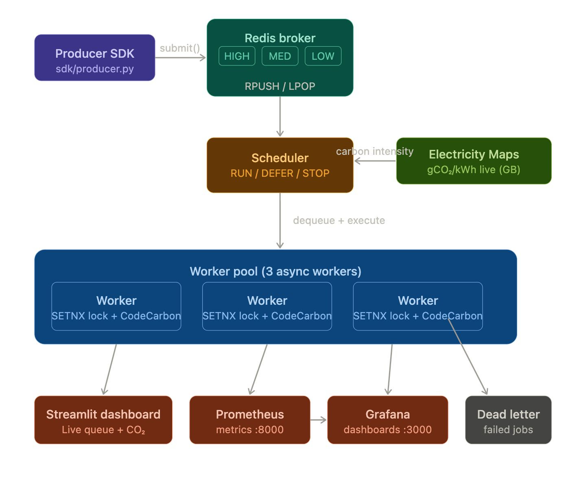

## Install
```bash
pip install energyqueue
```
> PyPI publish coming soon. For now clone and run locally — see Quick Start below.

### EnergyQueue — carbon-aware distributed task queue for ML training

---


**EnergyQueue is a carbon-aware distributed task queue that schedules ML training jobs based on real-time grid carbon intensity.**

---

### 2. Why it exists

ML training workloads are often scheduled without regard for **when** electricity is clean or dirty.  
This leads to:

- Higher **carbon emissions** than necessary for the same training job.
- Under-utilization of naturally greener windows on the grid.
- Little visibility into the **energy and CO₂ cost** of individual runs.

EnergyQueue addresses this by:

- Continuously monitoring real-time **carbon intensity** for a grid zone.
- Making **scheduling decisions** (RUN / DEFER / THROTTLE / STOP) based on carbon intensity and an **energy budget**.
- Providing a **dashboard** to observe queue health, carbon intensity, and budget usage in real time.

---

### 3. Architecture overview



At a high level, EnergyQueue consists of:

- **Producers (`sdk/producer.py`)**  
  - Client-facing SDK to enqueue jobs with priority (HIGH / MEDIUM / LOW) into Redis-backed queues.
- **Broker / Queue Manager (`broker/queue_manager.py`)**  
  - Encapsulates Redis list operations for the three priority lanes (`queue:high`, `queue:medium`, `queue:low`).
  - Provides atomic `enqueue` / `dequeue_any` semantics.
- **Scheduler (`scheduler/`)**  
  - `CarbonClient` pulls or reads cached carbon intensity for a configured grid zone.
  - `EnergyBudget` tracks CO₂ consumed vs a configured budget.
  - `Scheduler` combines carbon intensity, budget, and job priority to decide whether to run, defer, throttle, or stop.
- **Workers (`worker/`)**  
  - Async workers that:
    - Pull jobs from the broker.
    - Use distributed locks (via Redis) to ensure a job is only processed once.
    - Execute strongly-typed job classes (`jobs/`) with energy measurement hooks.
    - Emit heartbeats and write to a dead letter queue upon failure.
- **Jobs (`jobs/`)**  
  - Base job abstraction plus concrete jobs (e.g. ML training, image resize).
  - Integrate with CodeCarbon to estimate energy and CO₂ per execution.
- **Dashboard (`dashboard/app.py`)**  
  - Streamlit application that connects to Redis.
  - Shows queue depth, carbon intensity, energy budget, scheduler decision, and recent completed jobs.
- **Infrastructure (`docker-compose.yml`, `Dockerfile`)**  
  - Dockerized services for Redis, worker(s), and the dashboard.
  - Local development and demo via `docker-compose`.

---

### 4. Tech stack

| Layer                 | Technology                                             |
|-----------------------|--------------------------------------------------------|
| Language              | Python (3.11+) with `asyncio`                         |
| Queue backend         | Redis (via `redis-py` async client)                   |
| Concurrency           | AsyncIO (no threads, no Celery)                       |
| ML / Jobs             | PyTorch, CIFAR-10 (example ML training jobs)          |
| Carbon accounting     | CodeCarbon                                            |
| Carbon data           | Electricity Maps API                                  |
| Dashboard / UI        | Streamlit                                             |
| Containerization      | Docker, Docker Compose                                |
| Testing               | pytest, pytest-asyncio                                |

---

### 5. Quick start

```bash
# 1) Clone the repository
git clone https://github.com/Sanj026/energyqueue
cd energyqueue

# 2) Create local env file
cp .env.example .env
# Edit .env to set REDIS_URL, ELECTRICITY_MAPS_API_KEY, etc.

# 3) Start everything with Docker Compose
docker-compose up --build
```

Then:

- Streamlit dashboard: typically at `http://localhost:8501`
- Redis: `redis://localhost:6379` (or as configured in `.env`)

---

## Benchmark Results
Run on MacBook Air M-series · Python 3.11 · 3 concurrent async workers · Live UK grid (GB zone)

| Metric | Value |
|---|---|
| Jobs submitted | 50 |
| Jobs completed | 48 |
| Jobs to dead letter | 2 (fault tolerance verified) |
| Total processing time | 160.77s |
| End-to-end throughput | 0.30 jobs/sec |
| Redis enqueue rate | 3,459 jobs/sec |
| Avg job execution time | 3.35s |
| CO₂ tracked | 76.65g across 48 jobs |
| CO₂ per job | 1.60g |
| Grid carbon intensity | 143 gCO₂/kWh (live UK grid) |

> **Note:** 0.30 jobs/sec is end-to-end including real PyTorch CIFAR-10 training (~5s per job). The 3,459 jobs/sec is raw Redis enqueue speed — the broker is not the bottleneck.

---

### 6. Key features

- **Carbon-aware scheduling**  
  - Uses real-time carbon intensity (from Electricity Maps) per grid zone.  
  - Scheduler returns RUN / DEFER / THROTTLE / STOP based on intensity and thresholds.

- **Distributed locking**  
  - Redis-based locks ensure each job is processed by at most one worker at a time.

- **Heartbeat system**  
  - Workers emit heartbeats into Redis to indicate liveness and allow monitoring of stalled workers.

- **Dead letter queue**  
  - Failed jobs are moved to a dead letter queue for later inspection and replay.

- **Energy budget tracking**  
  - Tracks cumulative CO₂ grams consumed vs a configured budget (`ENERGY_BUDGET_GRAMS`).  
  - Scheduler can stop or defer jobs when the budget is exhausted.

- **Dashboard visibility**  
  - Streamlit dashboard shows:
    - Queue depth by lane (HIGH / MEDIUM / LOW).
    - Current carbon intensity and a color-coded status.
    - Energy budget progress.
    - Scheduler decision.
    - Recent completed jobs.

---

### 7. Project structure

```text
energyqueue/
├─ broker/
│  ├─ queue_manager.py      # Priority queues and dequeue logic
│  └─ redis_client.py       # Async Redis client wrapper
├─ scheduler/
│  ├─ scheduler.py          # Core scheduling decisions (RUN/DEFER/THROTTLE/STOP)
│  ├─ carbon_client.py      # Carbon intensity cache + API client
│  └─ energy_budget.py      # Energy budget accounting in Redis
├─ worker/
│  ├─ worker.py             # Async worker loop, distributed locking
│  └─ heartbeat.py          # Heartbeat publisher
├─ jobs/
│  ├─ __init__.py
│  ├─ base_job.py           # Abstract base job + JobResult
│  ├─ ml_training_job.py    # Example ML training job (PyTorch, CIFAR-10)
│  └─ image_resize_job.py   # Example non-ML job using Pillow
├─ sdk/
│  └─ producer.py           # Client SDK to enqueue jobs
├─ dashboard/
│  └─ app.py                # Streamlit dashboard (queue, carbon, budget)
├─ tests/                   # pytest-based tests (unit & async)
├─ Dockerfile
├─ docker-compose.yml
├─ requirements.txt
├─ .env.example
└─ README.md
```

*(Exact contents may evolve; see the repo for the most up-to-date tree.)*

---

### 8. Environment variables

| Variable                    | Required | Default                     | Description                                                                 |
|----------------------------|----------|-----------------------------|-----------------------------------------------------------------------------|
| `REDIS_URL`                | Yes      | `redis://localhost:6379`   | Redis connection URL for queue, locks, budget, and dashboard metrics.      |
| `GRID_ZONE`                | No       | `GB`                        | Electricity Maps zone code (e.g. `GB`, `DE`, `US-CAL-CISO`).                |
| `CARBON_THRESHOLD`         | No       | `200`                       | Baseline carbon intensity threshold (gCO₂/kWh) used by the scheduler.       |
| `ENERGY_BUDGET_GRAMS`      | No       | `500`                       | Total CO₂ budget in grams for the current session.                          |
| `ELECTRICITY_MAPS_API_KEY` | Yes*     | _none_                      | API key for Electricity Maps. Required for live carbon intensity lookups.  |
| `STREAMLIT_SERVER_PORT`    | No       | `8501`                      | Port for the Streamlit dashboard.                                           |
| `PYTHONUNBUFFERED`         | No       | `1`                         | Recommended to keep logs unbuffered in Docker.                              |

\*If `ELECTRICITY_MAPS_API_KEY` is not set, the scheduler can fall back to a conservative default intensity, but live carbon-awareness will be degraded.

---

### 9. Research note

**Built as part of MSc Advanced Computing research at King’s College London on energy efficiency in ML pipelines.**
